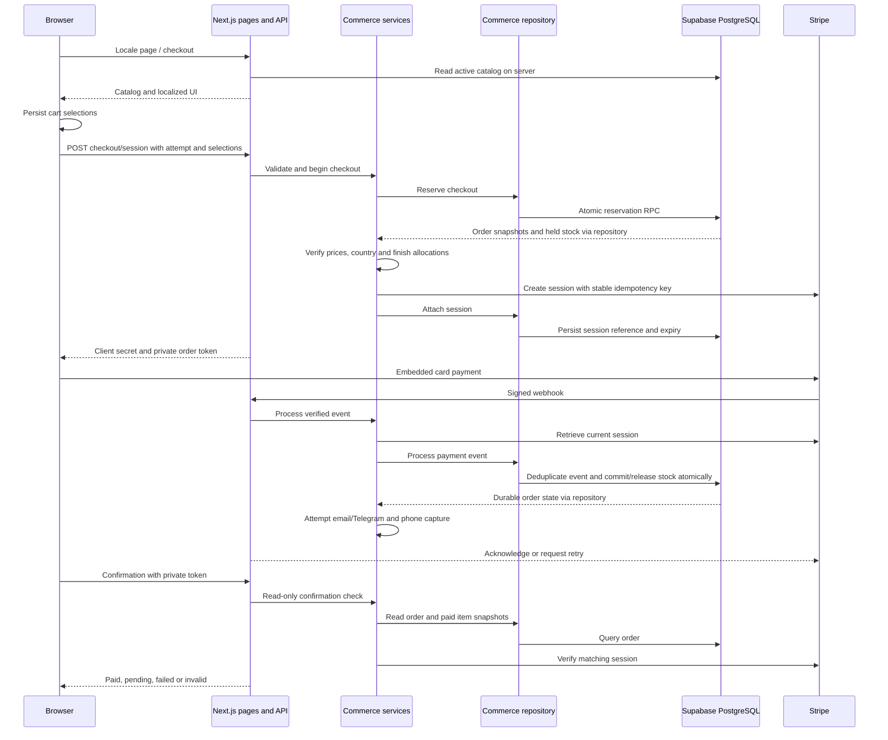

# LUMIZA Technical Architecture

Source inspection: 8 October 2026, branch `Harness-engineer`.
This document describes local implementation, not verified remote configuration.
See `AGENTS.md` for agent instructions and `docs/business-rules.md` for invariants.

## Stack and repository map

| Area                   | Implementation                                               |
| ---------------------- | ------------------------------------------------------------ |
| Application            | Next.js 16.3.5 App Router; React/React DOM 19.3.0            |
| Language and styling   | TypeScript 6.0.3, strict mode; Tailwind CSS 4.3.3            |
| Localization and theme | next-intl 4.14.6; next-themes 0.4.6                          |
| Validation             | Zod 4.6.5                                                    |
| Database               | Supabase PostgreSQL; supabase-js 2.117.0; SSR helpers 0.12.7 |
| Payments               | Stripe SDK 22.6.2; stripe-js 9.17.0; React Stripe 6.11.0     |
| Quality tools          | Vitest 5.0.1, Testing Library, jsdom, ESLint 9, Prettier 3   |

Versions come from `package.json` and `package-lock.json`. `README.md` requests
Node.js 22.12+ or 24+ and npm 11+, but package engines/runtime pinning are absent.

| Path                   | Responsibility                                                      |
| ---------------------- | ------------------------------------------------------------------- |
| `src/app`              | Localized pages, metadata, SEO endpoints and API route handlers     |
| `src/components`       | Shared UI, layout, sections, themes, contact and legal rendering    |
| `src/features`         | Product, commerce, email, Telegram, analytics and consent           |
| `src/config`           | Environment parsing, site URLs, merchant facts and security headers |
| `src/i18n`, `messages` | Routing, request configuration, FR/EN/DE translation dictionaries   |
| `src/lib`              | Supabase public-client factories and formatting utilities           |
| `src/styles`           | Global CSS and semantic theme tokens                                |
| `public`, `assets`     | Served resources and source media respectively                      |
| `supabase/migrations`  | Six historical SQL changes, including TEST stock reset logic        |
| `supabase/production`  | Fresh-schema bootstrap, owner-stock template and verification SQL   |
| `tests`, `docs`        | Automated checks and documentation                                  |

There is one Next.js application, not a separate backend service or monorepo.

## App Router and rendering boundaries

- `src/proxy.ts` applies next-intl routing, excluding API, Next.js internals,
  Vercel internals and paths containing a dot.
- `src/i18n/routing.ts` declares `fr`, `en`, `de`, default `fr`, always-prefixed
  locale URLs. `src/i18n/request.ts` validates locale and loads its JSON dictionary.
- `src/i18n/navigation.ts` supplies locale-aware navigation helpers.
- `src/app/[locale]/layout.tsx` is the server layout: metadata, fonts, translations,
  header/footer, theme, consent, contact and analytics providers.
- `src/app/[locale]/page.tsx`, `src/app/[locale]/checkout/page.tsx` and
  `src/app/[locale]/order/confirmation/page.tsx` use `force-dynamic` rendering.
  The home page must read current active catalog entries instead of freezing them
  at build time. Static locale parameter generation does not make these pages static.
- Server Components load catalog and translations. Client Components handle
  product composition, gallery, cart, checkout, language/theme and consent controls.
- `src/app/robots.ts` and `src/app/sitemap.ts` provide SEO routes.
  `next.config.ts` configures next-intl and HTTP headers; checkout/confirmation
  are private and non-indexable. Confirmation also uses `no-referrer`.

## Layers and feature ownership

| Layer / feature     | Responsibility and entry points                                                                                                                                                                         |
| ------------------- | ------------------------------------------------------------------------------------------------------------------------------------------------------------------------------------------------------- |
| Product             | Local definitions/schemas/media in `src/features/product`; `data/purchase-catalog.server.ts` reads active database packs/finishes; `components/purchase-section.tsx` supplies the interactive selection |
| Commerce domain     | Pure calculations and state mapping in `src/features/commerce/domain`; schemas in `src/features/commerce/schemas/cart.ts`                                                                               |
| Commerce services   | `src/features/commerce/services/checkout.ts` orchestrates reservation/session creation; `payment-events.ts` validates current Stripe state; `confirmation.ts` reads and verifies orders                 |
| Commerce repository | `src/features/commerce/repositories/commerce-repository.ts` reads tables and invokes privileged RPCs; no browser imports                                                                                |
| Stripe adapter      | `src/features/commerce/stripe/client.ts` creates the server SDK; `mode.ts` checks session/event environment consistency                                                                                 |
| Email               | `src/features/email/provider.server.ts` defines the disabled adapter; `confirmation-email.server.ts` renders localized messages and dispatches outbox jobs                                              |
| Telegram            | `src/features/telegram/paid-order-notification.server.ts` verifies paid sessions, formats fulfillment information and sends owner alerts                                                                |
| Analytics           | `src/features/analytics` contains GA4, Meta Pixel, Clarity and purchase tracking                                                                                                                        |
| Consent             | `src/features/consent/consent.ts` validates/version-controls stored choices; consent components expose the UI                                                                                           |

API handlers enforce transport boundaries; services own orchestration; domains own
calculations; repositories own persistence access. PostgreSQL owns atomic stock
and durable payment transitions. Browser totals are never payment authority.

## API surface

All paths below are under `src/app/api`; commerce handlers declare Node.js runtime.

| Endpoint                      | Source                        | Responsibility                                                                         |
| ----------------------------- | ----------------------------- | -------------------------------------------------------------------------------------- |
| `POST /api/checkout/session`  | `checkout/session/route.ts`   | Validate environment, origin, body, country, locale and cart; call checkout service    |
| `POST /api/checkout/cancel`   | `checkout/cancel/route.ts`    | Validate origin/token, retrieve/expire Stripe session and reconcile                    |
| `POST /api/stripe/webhook`    | `stripe/webhook/route.ts`     | Verify raw-body signature, delegate event processing; return 503 on processing failure |
| `GET /api/internal/reconcile` | `internal/reconcile/route.ts` | Authenticate Bearer secret; recover pending orders and dispatch notifications          |
| `GET /api/health`             | `health/route.ts`             | Application liveness only; no database/payment health check                            |

## Supabase and persistence

The commerce repository and purchase catalog use server-only service-role clients
with session persistence/refresh disabled. The generic factories in
`src/lib/supabase/browser.ts` and `src/lib/supabase/server.ts` use the public key;
their existence does not implement customer login or administration.

The SQL models products, variants, packs, global/finish inventory, orders, items,
reservations, finish allocations, payment events and email/Telegram outboxes.
Reservation and payment RPCs use row locks, constraints and transaction rollback.
RLS and grants deny public commerce access; privileged writes use reviewed
`SECURITY DEFINER` functions with explicit `search_path`.

Read `supabase/production/001_fresh_commerce.sql` together with all six historical
migrations. The bootstrap currently has 11 tables/9 RPCs and **omits Telegram
and phone capture**. The application calls 12 RPCs. The complete historical schema
adds a twelfth table and a Telegram trigger function. Local SQL files do not prove
that any Supabase project has these objects or permissions installed.

## Browser state and external integrations

- `src/features/commerce/components/cart-store.ts` uses `useSyncExternalStore`:
  selections in `localStorage` under `lumiza-cart-v2`, with legacy v1 migration.
  It stores pack ID, composition and pack quantity, not trusted totals or card data.
- `src/features/commerce/components/checkout-client.tsx` persists attempt UUID
  and locale in `sessionStorage`; secrets/tokens remain in component or module
  memory. Pending requests and ready sessions are reused within the tab.
- Stripe renders Embedded Checkout (`ui_mode: embedded_page`) through its React
  integration. Card fields belong to Stripe; the server creates the exact session.
- Email delivery is disabled in the adapter. The outbox and localized rendering
  are implemented but do not establish actual email delivery.
- Telegram is optional and server-side. Its paid-transition outbox avoids replay
  alerts; ambiguous sends are not automatically repeated. Messages can contain
  customer name, email, phone and delivery address from the verified Stripe session.
- Consent in `localStorage` defaults optional categories off; invalid/old records
  grant nothing. GA4 needs analytics consent; Meta needs marketing consent.
- Clarity additionally requires production Node mode and Vercel Production;
  checkout/confirmation paths are excluded by its component. Consent changes update
  vendor consent, but previously loaded scripts are not guaranteed to be unloaded.
- Paid confirmation renders GA4/Meta purchase components. Actual vendor collection,
  URL sanitization and dashboard settings require browser/remote verification.

Sources: `src/features/analytics/google-analytics.tsx`,
`src/features/analytics/meta-pixel-provider.tsx`,
`src/features/analytics/microsoft-clarity.tsx`,
`src/features/analytics/purchase-analytics.tsx`,
`src/features/analytics/meta-purchase-analytics.tsx`.

## Environment contract

`.env.example` documents names only; `.gitignore` excludes local environment files.
Parsing lives in `src/config/env.ts`, `src/config/env.server.ts` and
`src/config/commerce-env.server.ts`; it occurs when integrations are used.

| Classification           | Variables / purpose                                                                                                |
| ------------------------ | ------------------------------------------------------------------------------------------------------------------ |
| Public                   | `NEXT_PUBLIC_SUPABASE_URL`, `NEXT_PUBLIC_SUPABASE_PUBLISHABLE_KEY`: public client configuration                    |
| Public                   | `NEXT_PUBLIC_SITE_URL`: authoritative checkout origin and return URL; SEO also uses `src/config/site.ts`           |
| Public                   | `NEXT_PUBLIC_STRIPE_PUBLISHABLE_KEY`: browser Stripe configuration                                                 |
| Public, optional         | `NEXT_PUBLIC_GA_MEASUREMENT_ID`, `NEXT_PUBLIC_META_PIXEL_ID`, `NEXT_PUBLIC_CLARITY_PROJECT_ID`: vendor identifiers |
| Server secrets           | `SUPABASE_SERVICE_ROLE_KEY`, `STRIPE_SECRET_KEY`, `STRIPE_WEBHOOK_SECRET`, `CRON_SECRET`                           |
| Server secrets, optional | `TELEGRAM_BOT_TOKEN`, `TELEGRAM_CHAT_ID`                                                                           |
| Server mode              | `STRIPE_MODE`: TEST default locally; explicit `test`/`live` in production                                          |
| Runtime                  | `NODE_ENV`, `VERCEL_ENV`: production checks and Clarity availability                                               |

Commerce validates matching Stripe key prefixes, distinct privileged/public keys,
project base URL, and site origin. Production requires public HTTPS plus a
`cron_`-prefixed secret of at least 37 characters. Telegram validates its own
configuration separately. No transactional email credentials are implemented.
Invalid commerce configuration disables checkout/catalog access; informational
landing content still renders. No synthetic payment replaces Stripe.

## Main flows and order diagram

Navigation resolves the locale and server layout. Product selection updates the
local cart. Checkout sends choices, country, locale and attempt ID. The server
reserves in PostgreSQL, checks snapshots/allocations, creates or reuses Stripe,
and returns the client secret. Webhooks and reconciliation persist payment state.
Confirmation independently reads PostgreSQL and Stripe; return navigation can
arrive before the webhook and legitimately show pending.

The diagram is the successful session path; uncertain creation keeps the hold.
The authorized reconciliation endpoint provides a recovery path, not a browser
side effect. Phone capture may fail after the payment transaction has committed.

## Verification boundaries and existing documentation drift

Vitest uses jsdom, one worker and mocked integrations (`vitest.config.ts`). Relevant
examples: `tests/checkout-service.test.ts`, `tests/stripe-webhook.test.ts`,
`tests/confirmation.test.ts`, `tests/step4-security.test.ts` and
`tests/production-bootstrap.test.ts`. Textual SQL assertions do not execute RPCs;
the bootstrap test's fixed nine-RPC list misses newer repository dependencies.
No tests/build were run to author this documentation.

- `README.md` retains TEST-only, FR/DE-only, global-stock and local-price claims
  that conflict with current implementation.
- `docs/production-database.md` describes four migrations and a final bootstrap;
  six files exist, and Telegram/phone objects are missing from that bootstrap.
- `docs/production-readiness.md` says no analytics scripts are installed;
  GA4, Meta and Clarity components are wired into the layout.
- No durable rate limiter, versioned cron schedule or full enforced CSP is visible.
- No Vercel deployment settings, GitHub protections, applied database schema,
  physical stock, webhook registration or operational monitoring were verified.

These discrepancies are recorded, not corrected here. Use the sources and
`docs/business-rules.md` to assess changes; obtain separate authorization for
remote inspection, migration or deployment.
